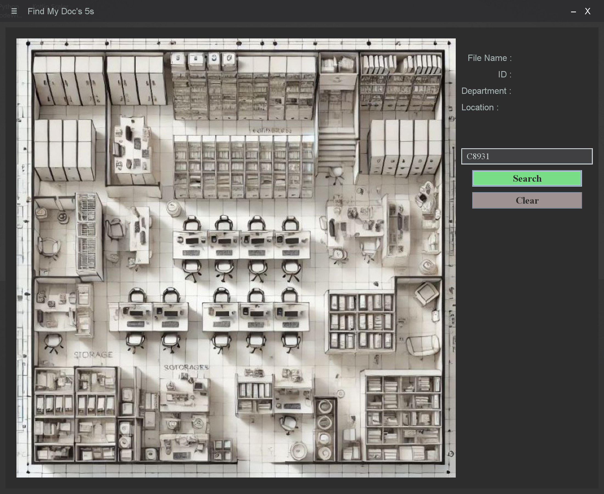

# FindMyDoc5s
A Java-powered Document Management System designed to streamline the organization, storage, and retrieval of files within an organization. The system provides an intuitive search functionality, allowing users to quickly locate documents based on keywords, categories, or metadata. In addition, it supports data import directly from Excel files, enabling bulk uploads and reducing manual entry errors.

By optimizing the document retrieval process, the system significantly reduces the time required to access important files, thereby improving workflow efficiency. It has proven particularly useful in 5S audits, ensuring that workplace organization and document management practices are more effective and consistent. The system enhances overall productivity, simplifies file tracking, and provides a reliable framework for maintaining structured and accessible document storage.

  

